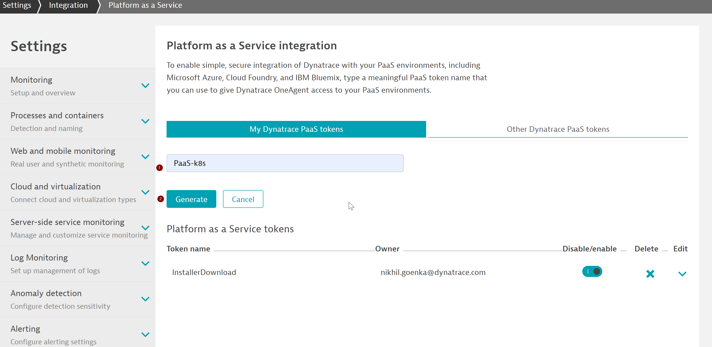

# Install Dynatrace OneAgent Operator

## Pre-requisites
Within your tenant, navigate to Deploy Dynatrace > Kubernetes  


Further, click on "Monitor Kubernetes". 

Now, from the drop-down, select the following config values:
Now, click on  for "PaaS Token", select "Create a new PaaS token" and click to open in a new window. Once navigated to the page, click on "Generate Token" to create a token.  


Give an appropriate name say "PaaS-k8s" and copy the token value in a temporary file.



Similarly, for "API Token" select "Create a new API token" and click to open in a new window.


*NOTE*:
When selecting the permissions, make sure you have the Access problem and event feed, metrics, and topology under "API v1" setting enabled for the API token.

## Oneagent Operator Installation
Dynatrace support multiple deployment strategies to install oneAgent Operator. We will use Helm approach.

Use the following command to install Helm 3.
`sudo snap install helm --classic`

1. Once helm is installed, add Dynatrace OneAgent Helm repository as below:
```bash
helm repo add dynatrace https://raw.githubusercontent.com/Dynatrace/helm-charts/master/repos/stable
```

2. Create a namespace *dynatrace* which will hold the operator deployment and it's dependencies. To create the namespace, use the command as below:
```bash
kubectl create namespace dynatrace
```

3. Now, create a values.yml with the text as below:
```bash
platform: "kubernetes"
operator:
  image: ""
oneagent:
  name: "oneagent"
  apiUrl: "https://ENVIRONMENTID.live.dynatrace.com/api"
  image: ""
  args:
    - --set-app-log-content-access=true
  env: {}
  nodeSelector: {}
  labels: {}
  skipCertCheck: false
  disableAgentUpdate: false
  enableIstio: false
  dnsPolicy: ""
  resources: {}
  waitReadySeconds: null
  priorityClassName: ""
  serviceAccountName: ""
  proxy: ""
  trustedCAs: ""
secret:
  apiToken: "DYNATRACE_API_TOKEN"
  paasToken: "PLATFORM_AS_A_SERVICE_TOKEN"

```

Replace the apiToken and paasToken configurables with the values retrieved earlier and set apiURL to point to your tenant.
For SaaS, configure apiUrl as https://<ENVIRONMENTID>.live.dynatrace.com/api , where ENVIRONMENTID is your tenant-id
For Managed cluster, use apiUrl as https://<my-server>/io/<ENVIRONMENTID>/api, where my-server is the domain name/ip of your server and ENVIRONMENTID is your managed environment

Once replaced, save the file.

4. Lastly, run the below command to apply the YAML
```bash
$ helm install dynatrace-oneagent-operator dynatrace/dynatrace-oneagent-operator -n dynatrace --values values.yaml
```

If succesful, you will get a prompt similar to the below and you will see the host appearing when you click on **Show Deployment status** 
```bash
NAME: dynatrace-oneagent-operator
LAST DEPLOYED: Wed Mar 03 02:01:30 2021
NAMESPACE: dynatrace
STATUS: deployed
REVISION: 1
TEST SUITE: None
NOTES:
Thank you for installing dynatrace-oneagent-operator.

Your release is named dynatrace-oneagent-operator.
```

# Start the sample-application
To start the sample-application pods, navigate to `/home/ubuntu/k8s` folder.
Under that folder you would be able to view the yaml files for front-end and mongodb deployment. In order to deploy the services and deployment, run the following commands:
`kubectl apply -n dynatrace -f app-deployment.yaml`
`kubectl apply -n dynatrace -f mongo-deployment.yaml`
`kubectl apply -n dynatrace -f mongo-service.yaml`
`kubectl apply -n dynatrace -f app-service.yaml`
This would create the deployment and services for all components for the application.

Now, in order to access the application from outside the k8s cluster, run the below command:
`kubectl expose deployment/app --type=NodePort --name=model-app -n dynatrace --port 30005`
This would create a service which will be accessible from outside the cluster using **<Instance-ip>:30005**.

Verify the service is up and running as expected using command below. <br>
`kubectl describe service model-app -n dynatrace`


### ⚠️ Troubleshooting steps

Negative
: To **check status of pods**, run command below. You should get a **Running** as a return.<br>
`kubectl get pods -n dynatrace`

Negative
: To **check the logs**, run command below.<br>
`kubectl logs -f deployment/dynatrace-oneagent-operator -n dynatrace`

Negative
: To **delete secrets**, run command below. You might have included a wrong secret previously. <br>
`kubectl delete secret --all -n dynatrace`

Negative
: To **delete all pods**, run command below. This will cycle through the pods and you will have new pod instances.<br>
`kubectl delete --all pods -n dynatrace`

Negative
: To **check status of deployments**, run command below. You should get a **Running** as a return.<br>
`kubectl get deployments -n dynatrace`

Negative
: To **check status of services**, run command below. You should get a **Running** as a return.<br>
`kubectl get deployments -n dynatrace`

Negative
: To **delete a service**, run command below.<br>
`kubectl delete service <serviceName> -n dynatrace`

Negative
: Official troubleshooting page could be found [here](https://www.dynatrace.com/support/help/technology-support/cloud-platforms/google-cloud-platform/google-kubernetes-engine/installation-and-operation/full-stack/troubleshoot-oneagent-on-google-kubernetes-engine/)


# Accessing the application
Now, register an user on the application at http://<IP-address>:30005/register page with the following details:  
**Name**: Guest User  
**E-Mail Address**: guestuser@mybank.com  
**Password**: GuestUser12@  
**Name**: 123456789  


As you have completed registering yourself on the application, now login into the app from http://<my-IP>:30005/login with the credentials as below:  
**E-Mail Address**: guestuser@mybank.com  
**Password**: GuestUser12@


