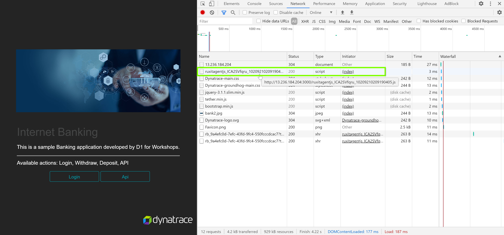
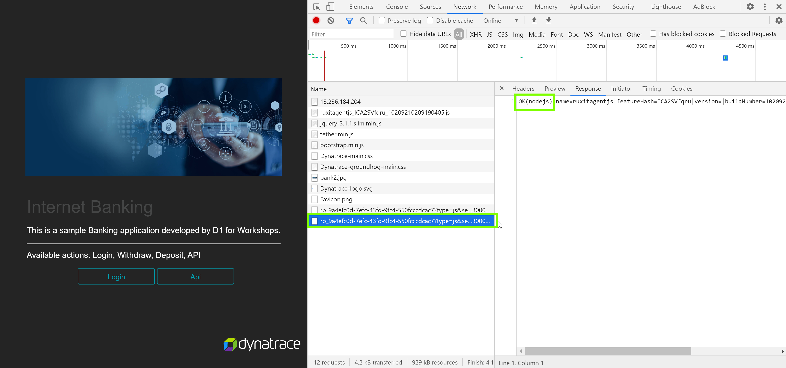
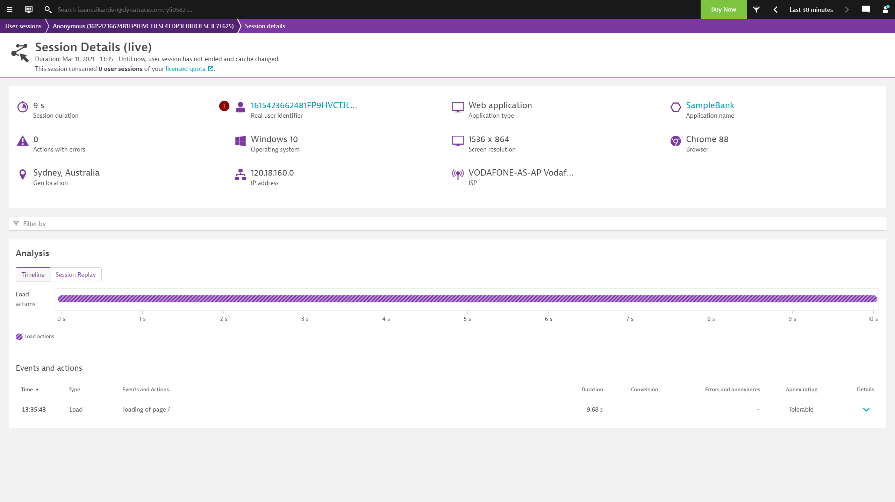
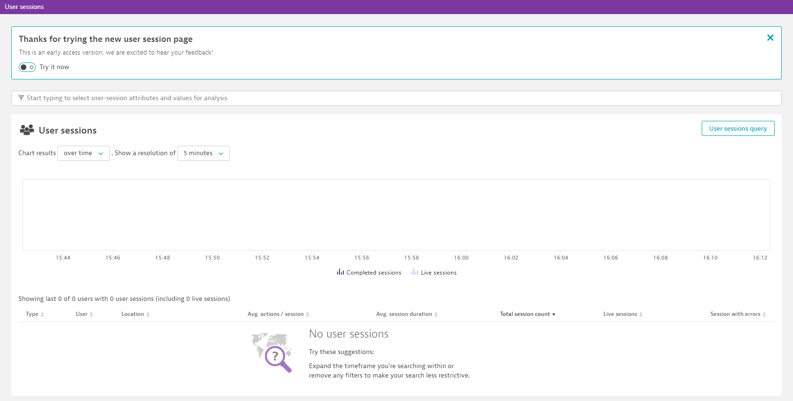
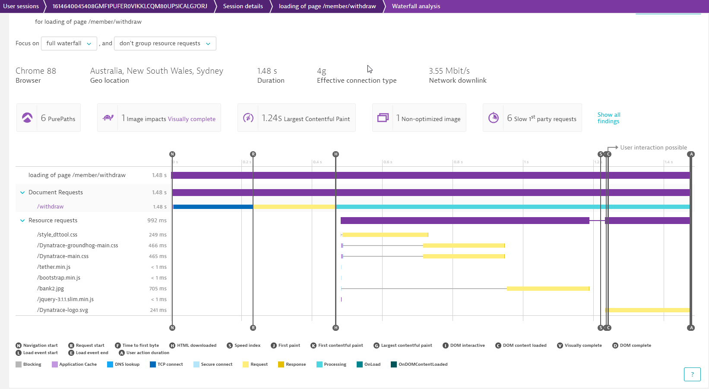
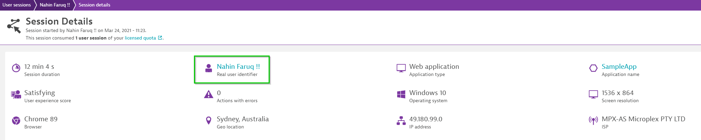

summary: Introduction to RUM
id: RUM-Kubernetes
categories: scrum-intro
environments: steplabs
status: Published
author: Abhinandan Anantha
feedback link: mailto:d1-apac@dynatrace.com
analytics account:
<!-- ------------------------ -->
# Install Dynatrace OneAgent Operator
<!-- ------------------------ -->
## Pre-requisites
Within your tenant, navigate to Deploy Dynatrace > Kubernetes  


Further, click on "Monitor Kubernetes". 

Now, from the drop-down, select the following config values:
Now, click on  for "PaaS Token", select "Create a new PaaS token" and click to open in a new window. Once navigated to the page, click on "Generate Token" to create a token.  


Give an appropriate name say "PaaS-k8s" and copy the token value in a temporary file.


Similarly, for "API Token" select "Create a new API token" and click to open in a new window.


*NOTE*:
When selecting the permissions, make sure you have the Access problem and event feed, metrics, and topology under "API v1" setting enabled for the API token.

<!-- ------------------------ -->
## Oneagent Operator Installation
Dynatrace support multiple deployment strategies to install oneAgent Operator. We will use Helm approach.

Use the following command to install Helm 3.
`sudo snap install helm --classic`

1. Once helm is installed, add Dynatrace OneAgent Helm repository as below:
```bash
helm repo add dynatrace https://raw.githubusercontent.com/Dynatrace/helm-charts/master/repos/stable
```

2. Create a namespace *dynatrace* which will hold the operator deployment and it's dependencies. To create the namespace, use the command as below:
```bash
kubectl create namespace dynatrace
```

3. Now, create a values.yml with the text as below:
```bash
platform: "kubernetes"
operator:
  image: ""
oneagent:
  name: "oneagent"
  apiUrl: "https://ENVIRONMENTID.live.dynatrace.com/api"
  image: ""
  args:
    - --set-app-log-content-access=true
  env: {}
  nodeSelector: {}
  labels: {}
  skipCertCheck: false
  disableAgentUpdate: false
  enableIstio: false
  dnsPolicy: ""
  resources: {}
  waitReadySeconds: null
  priorityClassName: ""
  serviceAccountName: ""
  proxy: ""
  trustedCAs: ""
secret:
  apiToken: "DYNATRACE_API_TOKEN"
  paasToken: "PLATFORM_AS_A_SERVICE_TOKEN"

```

Replace the apiToken and paasToken configurables with the values retrieved earlier and set apiURL to point to your tenant.
For SaaS, configure apiUrl as https://<ENVIRONMENTID>.live.dynatrace.com/api , where ENVIRONMENTID is your tenant-id
For Managed cluster, use apiUrl as https://<my-server>/io/<ENVIRONMENTID>/api, where my-server is the domain name/ip of your server and ENVIRONMENTID is your managed environment

Once replaced, save the file.

4. Lastly, run the below command to apply the YAML
```bash
$ helm install dynatrace-oneagent-operator dynatrace/dynatrace-oneagent-operator -n dynatrace --values values.yaml
```

If succesful, you will get a prompt similar to the below and you will see the host appearing when you click on **Show Deployment status** 
```bash
NAME: dynatrace-oneagent-operator
LAST DEPLOYED: Wed Mar 03 02:01:30 2021
NAMESPACE: dynatrace
STATUS: deployed
REVISION: 1
TEST SUITE: None
NOTES:
Thank you for installing dynatrace-oneagent-operator.

Your release is named dynatrace-oneagent-operator.
```
<!-- ------------------------ -->
## Start the sample-application
To start the sample-application pods, navigate to `/home/ubuntu/k8s` folder.
Under that folder you would be able to view the yaml files for front-end and mongodb deployment. In order to deploy the services and deployment, run the following commands:
`kubectl apply -n dynatrace -f app-deployment.yaml`
`kubectl apply -n dynatrace -f mongo-deployment.yaml`
`kubectl apply -n dynatrace -f mongo-service.yaml`
`kubectl apply -n dynatrace -f app-service.yaml`
This would create the deployment and services for all components for the application.

Now, in order to access the application from outside the k8s cluster, run the below command:
`kubectl expose deployment/app --type=NodePort --name=model-app -n dynatrace --port 30005`
This would create a service which will be accessible from outside the cluster using **<Instance-ip>:30005**.

Verify the service is up and running as expected using command below. <br>
`kubectl describe service model-app -n dynatrace`


### ⚠️ Troubleshooting steps

Negative
: To **check status of pods**, run command below. You should get a **Running** as a return.<br>
`kubectl get pods -n dynatrace`

Negative
: To **check the logs**, run command below.<br>
`kubectl logs -f deployment/dynatrace-oneagent-operator -n dynatrace`

Negative
: To **delete secrets**, run command below. You might have included a wrong secret previously. <br>
`kubectl delete secret --all -n dynatrace`

Negative
: To **delete all pods**, run command below. This will cycle through the pods and you will have new pod instances.<br>
`kubectl delete --all pods -n dynatrace`

Negative
: To **check status of deployments**, run command below. You should get a **Running** as a return.<br>
`kubectl get deployments -n dynatrace`

Negative
: To **check status of services**, run command below. You should get a **Running** as a return.<br>
`kubectl get deployments -n dynatrace`

Negative
: To **delete a service**, run command below.<br>
`kubectl delete service <serviceName> -n dynatrace`

Negative
: Official troubleshooting page could be found [here](https://www.dynatrace.com/support/help/technology-support/cloud-platforms/google-cloud-platform/google-kubernetes-engine/installation-and-operation/full-stack/troubleshoot-oneagent-on-google-kubernetes-engine/)

<!-- ------------------------ -->
## OneAgent Application Injection

In this exercise, we will check the OneAgent injection into the application and verify the injection of the JavaScript in the application UI.

### How to check application is monitored by OneAgent?

To confirm that the application's web front-end process is monitored, go to the application UI and check if the RUM JavaScript tag has been correctly injected into the application's HTML

Navigate to the application UI and open the browser's DevTools to check the **Sources** and cleck the `<HEAD>` element to locating the JavaScript. Search the script that contains the string `ruxitagentjs` in its file name.


### Exploring Dynatrace

Login to the Dynatrace environment and explore around **Smartscape, Host View.**

To make sure that the application requests are captured by Dynatrace, go to **Host > ec2-instance > bin/www (node-bank2)** which is the Application Process.

You will discover that Dynatrace automatically monitors the host metrics, processes but not the **services**


### Accessing the application
Now, register an user on the application at http://<IP-address>:30005/register page with the following details:  
**Name**: Guest User  
**E-Mail Address**: guestuser@mybank.com  
**Password**: GuestUser12@  
**Name**: 123456789  


As you have completed registering yourself on the application, now login into the app from http://<my-IP>:30005/login with the credentials as below:  
**E-Mail Address**: guestuser@mybank.com  
**Password**: GuestUser12@

<!-- ------------------------ -->
## Troubleshooting

In this excerise, we will verify if the OneAgent is monitoring the application.

### Confirming that the RUM JavaScript tag has been correctly injected into the application's HTML

Check for the Dynatrace JavaScript if the application contains the string `ruxitagentjs` in the **Source** files under the `HEAD` element

```bash
*script* type="text/javascript" src="/ruxitagentjs_[...]_[...].js" data-dtconfig="[...]" */script*
```  


### Confirming that the RUM JavaScript tag has downloaded correctly

With the help of browser DevTool, load the application's page and navigate to **Network** section. Confirm if the response of the JavaScript code exists with a response status `200 "OK"`



### Confirming that RUM monitoring data is been sent to Dynatrace

The JavaScript Tag reports back data via XHR or CORS post requests. The requests can be viewed among the **Network** operations using the browser DevTools. The URL related to the request will begin with `rb_` and must have status `200 "OK"` response and must start with `**OK**`



### Verify real user identifer is equal to cookie value

Create a new user session and then navigate to your tenant and find the real user identifier.



Navigate back to to the sample application and in chrome dev tools to find the cookie value and verify it matches with the real user identifier. 

 

<!-- ------------------------ -->
## Defining the Application

In this excerise, we will define the Application detection rule to route the traffic. 

As a starting point, all monitoring data is encapsulated in a placeholder application called `My Web Application`. The reason being that this placeholder applicaiton is to allow for more flexibility, as it would be easier on how the applications should be organized.

### Application detection rule

Application detection rule would falicated to create more applications, change existing application mapping, or if needed define more complex rules looking at URL's and not only on domains.

From the navigation menu, select **Settings > Web and mobile monitoring > Applications detection**. Under the **Define application detection rule** section, the list of defined rules are available in the sequential order and the top of list takes the priority over the following rules.

Select **Add detection rule** and select the rule applies to `New application` and provide a custom name for the application under the name text field. 

Define which web requests are part of this application by selecting the condition as `If the URL` and scope to be `contains` with the `<IP ADDRESS>:3000`


<!-- ------------------------ -->
## RUM User Session Details

In this excerise, we will be highlighting "User Sessions" and different user actions captured in the user-session. We will also be looking into the waterfall model to view application load times.

1. Navigate to User sessions from the burger menu on the left. There will be no user sessions  


1. Create a user session by navigating through the sample application in an incognito window and then close the broweser window when complete.  


1. Navigate back to the Dynatrace tenant and view the the user action  


1. Navigate to session details for further drill-down  


### Waterfall Analysis 

Dynatrace captures user experience and performance data by monitoring individual user actions. Typically a user action begins with a click on an HTML control (for example, a button or link). The browser then loads the requested data, either by navigating to a new page or via an XHR/fetch call. JavaScript callbacks are then executed, the DOM tree is built or changed, and the web application is then once again ready for a new user action. 

Select a user action and perform a waterfall analysis



### Key User Actions

With the key user action feature, you can customize the Apdex thresholds for each of these user actions. You can use this feature to monitor key actions with a dedicated dashboard tile and track historic trends.

1. Navigate to the applications page and the select the application
2. Click view full details under the Top 3 user actions
3. Under Top 100 user actions, select a user action.
4. On the top-right corner of the User action details page, select Mark as key user action. The selected user action will now be displayed under Key user actions on the User action analysis page.


<!-- ------------------------ -->
## User Session-Property & User Tag

In this exercise, we will need to define the Request attribute to track specific request. 

### Define Request Attribute

1. Select "Settings" from the navigation menu
1. Click on "Server-side service monitoring" 
1. select "Request attributes"
1. Click on Select "Define a new request attribute"
1. Provide "Request attribute name" as **Amount**, will leave rest of the settings as default.
1. Click on "Add new data source"  


1. Click on "Request attribute source" dropdown, select **HTTP POST parameter** and provide a "Parameter name" as **amount**, and click on "Save".
1. After defining the Request attribute, click on "Save".  


### Define session property
1. Select "Application" fro the navigation menu and select "SampleApp" application
1. Click on "..." and select "Edit"
1. Click on "Capturing" and select "Session and action properties"
1. Select "Add property"
1. Select **Server side request attribute** from "Expression type", select **Amount** from Request attribute name, provide "Display name" as **Amount entered**, and enable "Store as session property" and click on "Save property"  


After setting it up, we can generate user sessions and to review it, we will need to navigate to "User Sessions" and select the generated session, under the session we can see our defined user session property as highlighted,   


### Define user tag
1. Navigate to Sample SampleApp's settings page
1. Select "Capturing" and click on "User tag"
1. Select "Add tag(identifier) rule"
1. Select "CSS selector" and define it as  **body>div:nth-child(1) > p**, enable "Apply cleanup rule" and define the regex as **\welcome(.*+)** and Click on "Save changes"  


1. Select "User Sessions" from navigation and we can see our generated session with the user tag, we can click on the user session and can see the user tag  


<!-- ------------------------ -->
## Conversion Goal

In this excerise, we will define Conversion goal and monitor the user session which has met the goal defined.

### Creating Conversion Goal

To define a conversion goal, navigate to the application settings by clicking on **Browse [...] > Edit**. Select **Session Replay and behaviour > Conversion goals** and click **Add goal** to set up the goal.

1. Start with defining the **Name** of the goal 
1. Select respective **Type of goal** as `User Action` 
1. followed by **Rule applies to:** to be `Load actions` 
1. Define the **Rule:** to be `Action name > contains > /member/withdraw`
1. Click on the **Save** to save the defined conversion goal.  


### Measuring Conversion Goal

1. Navigating to the **User session**.
1. Use the filter option to sort the user session which met the conversion goal defined by selecting **Conversion Goal** 
1. Selecting the **Goal**. 
1. Selecting the sepecific user session and navigating to the user actions, the defined user action will be easy to identy goal by searching the [🏁] symbol.  


<!-- ------------------------ -->
## Session Replay

In this excerise, we will configure Session replay and check the session replay which captured the user session.

### Enable session replay

1. To enable Session Replay navigate to the **Applications** menu
1. Select the application which needs to be configured. 
1. Select the **Browse [...]** button **> Edit**. 
1. From the application settings menu, select **Session Replay and behaviour > Session Replay** and turn on **Enable Session Replay** togel.


### Masking Session Replay

Session Replay implements masking functionality that ensures that private user information is either not captured at the time of recording and/or masked at the time of session playback.

This option allows a more customized aproach to configure masking. The changes in the configuartion can be made to suite the session-recording requirements which does not require any changes in the application code. The functionality is used to hide interactions with specific elements that might inadvertently reveal confidential end-user information. 


### Sample Session Replay

<!--  -->